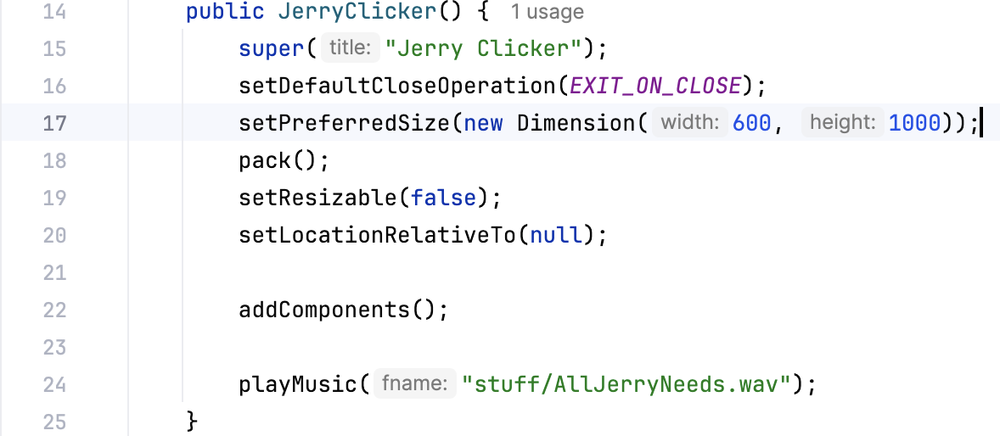

# JerryClicker
A cookie clicker clone with some creative liberties that I made to understand swing and awt.

GUIs are very powerful tools that can help add visual aspects to programs. I personally want to get more complex interactive experiences from my programs. One way to use GUI's is by using the java.swing and java.awt libraries. One of the best ways to get a better understanding of these libraries is through simple programs like login prompts, or--in this project's case--Cookie Clicker. The goal of Cookie Clicker is simple, click on a cookie and watch the number of clicks go up. 

I made this version of Cookie Clicker following a YouTube tutorial by TapTap from their "10 Java Projects that Beginners Should Do" video. I tried to make this project a little more my own by taking some (let's call them) creative liberties. Since swing and awt are pretty new to me, I thought it would be more beneficial to go through line-by-line and explain what the purpose is to get a better understanding of the capabilities of the libraries.

## Constructor

The JerryClicker class is an inherited class extending JFrame, which is essentially the class that makes the main window of a swing program. This allows us to use JFrame methods on our Jerry Clicker program. The super constructor inherits the JFrame constructor for Jerry Clicker and allows to give the frame a title.

The other methods all set behaviors and attributes for the window. Line 16 sets the window to be closed completely and exited by the program using System.exit method. Line 17 sets the size of the frame using a Dimension object, which sets the width and height in pixels. Line 18 is just the pack() method, which causes the window to fit the size of it's panel compenent which holds all of the subcomponents. Lines 19 and 20 are pretty self-explanatory, they lock the window size since setResizeable is set to false, and centers the window to the screen when Jerry Clicker is launched since null is passed to setLocationRelativeTo(). 

That leaves the last two methods of the constructor. addComponents() is a void method that makes a JPanel that will hold all of the components to make Jerry Clicker work. playMusic() will play a looping audio file that will play as long as Jerry Clicker is open. I'll get to these methods more in-depth in a bit, but it's just important to note that they're part of the constructor, so an object is initialized that will execute. This further means that an object will all the components and music playing will be created, but if there is not to make it visible, then the user won't be able to interact with it in any meaningful way.

## addComponents()

This is the most important method of the JerryClicker class. The constructor only made the window, but once it executes this method adds all of the components that add to the visuals and interactive components of Jerry Clicker. Line 28 initializes and assigns a SpringLayout object. The SpringLayout class is a way to move objects around in an area using code and pixel counting. If you're using an application like NetBeans you don't have to worry about this with its GUI Builder, but Jerry Clicker was written in IntelliJ, so it's kind of relevant to this project. I'll get more into how I used when I get to the relevant putConstraint() method.

Line 29 initializes a JPanel. The JPanel will be the container for everything. It will hold a banner image, the Jerry Button, a click counter and it's associated text field, and a reset button. The only method that acts directly on the JPanel that we have right now is setLayout() in Line 30. This will set the layout manager to be the springLayout object. There are other layout manager, but I don't know anything on them as of now so I can't speak on them. From here, we will so how each individual subcomponent is added to the JPanel and how they work as GUI objects.

### The Banner

This section is unfortunately underwhelming because in terms of coding it creates a JLabel from the loadPicture method, which we won't talk about for a bit, and then adds it to the JPanel. For now, loadPicture() takes a directory path, a boolean for if the picture needs to be resized, and the new dimensions of the picture for resizing. The add() method actually adds the banner right to where it needs, so springLayout isn't needed here.

In terms of how Jerry Clicker functions as a GUI. The banner is pretty important. It's the only component that conveys information about the purpose of the app to the user. Given, it does only say "Jerry Clicker" but that's enough to let the user know what they do with the program. 

### The Jerry Button

The Jerry Button has some complexities to it since it incorporates a couple of new things. First a JButton is made from the createImageButton() method. This method will also be touched on later, but for now, just know that it serves a very similar purpose as the loadPicture() method returning a JButton instead. To touch upon JButtons, they are push buttons that users can interact with to do something in the program. As you'll see in line 39, this needs to be implemented using the addActionListener() method. In this case, it's taking in a lambda function as it's argument and that function is incrementing the counter field on each click and playing a sound.

This is also the first example of using the SpringLayout to move an object into place. First the Jerry Button must be added to the JPanel and then it can be moved using the putConstraints() method of the SpringLayout class. There are five parameters to enter when using putConstraints. The first two parameters are the edge of the component you want to move and the component itself. In this case the first two parameters will be for the west edge of the Jerry Button, so using the WEST attribute of the SpringLayout we add (SpringLayout.WEST, jerryButton, ...). Next, we add the padding or how many pixels we want to move the object. I could have done math for this using the size of the button and the size of the window, but I just guessed and checked and thought 40 pixels seemed right for the west edge. Then, the last two parameters are added which are what for what the first two parameters are moved relative to. In case, we're moving relative to the JPanel and its west side so we add (..., SpringLayout.WEST, jPanel) to the method call. This will move the west side of the Jerry Button 40 pixels away from the west side of the JPanel. This is then repeated with the north side of the Jerry Button to move it down the JPanel. SpringLayout is pretty simple to understand (at least to me) and seems like a good layout manager for people just starting to use GUIs.

### "Jerries: " Label

The "Jerries: " JLabel is the simplest GUI component to explain. The standard constructor for a JLabel object is a string that will be displayed which is all that line 51 does. The setFont() method then acts on the counterLabel object to set the font of JLabel. It takes in a Font object which takes parameters for the font title, font style (plain, blod, or italicized) and the size. This is then added to the JPanel and moved using the SpringLayout.

### Counter Field

The counter field is the incrementing number that increases with each press of the Jerry Button. The counter field is a JTextField object, an object that creates an area of text that can be edited either directly by the user edited by the program. The constructor in Line 60, takes in an integer for the number of columns in the text field, which is the number of characters that can occupy the text field. The font is then set similarly to how it's set for the Jerries label. The text for the counter is then aligned to the right using the setHorizontalAlignment() and by passing in the SwingConstants.RIGHT member variable. The text is also set to be uneditable using the setEditable() method. This only makes it uneditable for the user, the program can still access the text in this field and update it. Like the Jerries Label and Jerry Button, the Counter Field is added to and moved around on the JPanel.

### Reset Button

The last component to add is the reset button, which sets the counter back to zero when pressed. Since the reset button is just a text button, the constructor just takes in the string "RESET" to display it. The font for the "RESET" text is set using the same setFont function as the Jerries Label and the counter field and an ActionListener is added which takes in a lambda fuction that sets the text in the counter field back to zero when pressed. The reset button is added and moved the same way all the other components were added and moved.

The full JPanel is now created with all the necessary components. The very last thing addComponents needs to do is add the JPanel to the JFrame object. This is done by calling getContentFrame() on the JerryClicker object and adding the JPanel to that content frame using the add method. This the bulk of the work needed to initalize Jerry Clicker, but there were a few methods used in the constructor and addComponents() that have not been reviewed yet.

## createImageButton() and loadPicture()

Since images can't just be directly passed into the JButton constrcutor a method needs to be made to create an image button. createImageButton is set as a try-catch function since an incorrect file name could possibly be passed into the function. If a file that does not exist is passed into the function, an error will be given an the function will return null. If the file does exist, then the first step is to create an InputStream object. The first part, this.getClass(), gets the class loader for the class with getResourceAsStream using the relative path of the filename. Using this InputStream a BufferedImage is created using the read() method from the ImageIO class. read() only accepts an input stream to create a BufferedImage, so its pretty easy to make a BufferedImage since there's only one way to do it. If the isResized parameter is true, then the resizePicture() method will make a new image to the specified performances. Now, a JButton can be created by passing an ImageIcon object as the parameter for the JButton using the newly created BufferedImage and the method returns this image button. The loadPicture method works exactly the same, except it creates a JLabel object instead of a JButton object.

## resizePicture()

This the method called by createImageButton() and loadPicture() to resize the button and the banner if needed. The BufferedImage() constructor takes in a height and width for its parameter as well as a color space image type. Next using the newly created, blank BufferedImage, a Graphics2D object is made. Graphics2D is a class used to more easily make shapes and manage colors, and do various graphics thing. This class isn't super important for this project other than for this particular method. The main purpose of calling it is to use the drawImage() function which takes in an image to be drawn (which will be the image for the button or banner), the starting x and y coordinates, the new dimensions for the image to be drawn in, and an ImageObserver object (this isn't used at all so null is passed in). Once the new image is drawn to the proper dimensions, the graphics2D object must be disposed since, according to the documentation, it's better to dispose of the object manually than by relying on garbage collection if there are a lot of graphics 2D objects. The method will then return the new BufferedImage for the createImageButton() method or loadPicture() method to have properly sized pictures.

## playMusic() and playSound()

As a way to set my project apart a little more, add some tactile feedback, and help create an atmosphere, I decided to music and play a sound when the Jerry Button is pressed. Both these methods are relatively similar, but they have a few important differences.

playMusic() is the method from the constructor that will a song as long as Jerry Clicker is open. Like the loadPicture() and createImageButton() methods, it also has a try-catch set-up to return an error if a file doesn't exist or can't be found. It starts by getting an input stream the same way as the images but then passes it to an AudioInputStream object. A clip object is then also created in line 131. The clip is the class that represents the actual audio in the java code. From what I've see in my research, wav files tend to work the best for clips since no extra parsing is needed, but it is important to note that mp3s are smaller and easier to retrieve in code. Now that file is loaded its information can be accessed with open() method. I did also decide to do a bit of volume control since I found the audio to be little loud. This is done by getting a control from the clip using the getControl() method. Once the volume is turned down using the setValue() method on the FloatControl object, the clip is then played and looped using the loop() method. This makes it so that the audio will play as long as Jerry Clicker is open.

NOTE: The music file was too big to add into the repo. If you want the true JerryClicker experience then add a .wav file of "All I Need" by Radiohead.

playSound() is very similar to playMusic(). It's the method used in the ActionListener from the JerryButton component for the button to make a sound when pressed. The first five lines of the try block in playSound() are the same as playMusic(), but after that it differs. First, since the sound is being played mulitple times, the frame position must be set back to the start since clip playback position is stored by java. I also modified the volume for the sound just like I did for the music, but I turned it up instead since it was a little quiet. Now that all of that is set up, the audio file can be played with the start() method and sound is played with a button press.

## main() and Closing Thoughts

The last thing to make Jerry Clicker run is to load it in a main method. There is only one line of code in the main method and that is creating a new JerryClicker and make it visible. Remember the constructor for JerryClicker already made all of the necessary stuff for JerryClicker, the user just needs to be able to see it. This done by using the setVisible method on the JerryClicker object and passing in a true boolean. 

And that completes JerryClicker. Overall, it was a very simple project, but I think I have a much better understanding of how to use swing and awt and work with GUI libraries now. There are definitely some more technical details I missed, but I didn't want to get lost in the weeds too much and most of this just used the java documentation I had available to me. I also think working with some of the audio libraries was just a nice thing to add since I didn't want this project to feel boringly simple. Using the knowledge I gained I can see myself working more with GUIs to build more robust projects.
